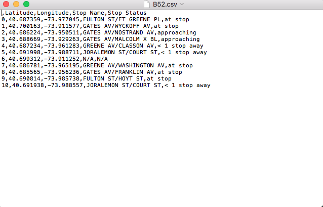

#HW2
This is HW 2. I'm editing this in my local text editor called Atom.

I worked with the following people: Valeria, Srikanth, and Matt.
Matt wrote the code on his computer with Valeria, Srikanth, and I assisting, looking up items and researching the best ways to arrange our code.

HW2_1
For this task I created the file show_bus_locations_shi211.py
Before creating this file locally on my machine and pushing it to GitHub, I ran it in Jupyter notebooks so that I could run the code and ensure that everything was displaying correctly.

I started by following the beginning of the labs and notebooks on Fedhere's GitHub page. The notebook APIreadingJson.py.ipynb was particularly helpful in dictating how to set up the code and what to import, and how to read the information from the MTA url. Matt helped walk me through how to set up the concatenated sentence with the MTA url, API key, and specific bus line reference.

Next was using the urllib funciton to ensure that the file could read the data on the MTA site.

Next each bus was isolated using the indbus command(?). This sentence references the location that pulls the ID for the specific bus whose information. This is needed for the "for loop"(? not sure that's the right term), which references each bus to pull the information specific to each bus.

After testing this in the Jupyter space, I created created the .py file referenced above and ran it using Terminal. Two items came up when running it in terminal in order to make it work correctly:
1) Hiding mta_key and bus_line - instead of listing my actual API key and the specific bus number, respectively, the following statement was added in: sys.argv[1]
This argument allows you to enter in the specific API key and bus number in terminal.
2) Conversion issues with Python 2 vs Python 3 - I have Python 3 on my computer. This is in conflict with how the urllib2 function works. I looked up a way to work around this and used this function to make it run locally: import urllib.request as urllib2. That said it's set up to run on Python 2, per class protocol.

HW2_2
This code was very similar to HW2_1.
The for loop at the end of the code was very interesting. Instead of just pulling the information and printing, like HW2_1, this loop sends the generated information into a data frame which will become the .csv file.

The most interesting thing about this was working with Matt to determine how to incorporate empty values to be expressed as 'N/A' in our for loop. We noticed that only sometimes when the code was run did bus fields end up with a blank. We inferred that this is because a bus has ended its route and no longer has a next stop. We struggled with how to call this out as we didn't know if the data would show as "0", "empty", or simily return a blank space. After looking researching and talking with Srikanth, we came up with the try/except phrase that you see in the code.

From the screenshot below, you can see that it worked when I ran the code and generated a .csv file.

